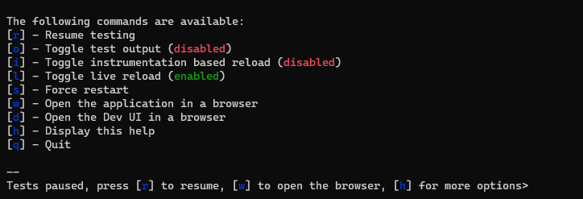

# Quarkus 2 vs Quarkus 1 - Developer's Experience

Couple of days ago the Quarkus Community introduced a new major release - Quarkus 2.

Quarkus 1 is awesome. Not only because of the features it brings but mostly about how easy it is to develop with it.
Then comes Quarkus 2 which brings the developer's experience to another level.

## Improvements of Dev mode

Quarkus 1 already offers hot-code-replacement out of the box. This is a huge benefit in comparison with most of the
non-Quarkus environments where one has to struggle to make hot-code-replacement work. Often using 3rd Party tools which
do not always work reliably.

Technically there is no real hot code replacement in Quarkus but rather a restart when code is changed and we are
interacting with the application.

We, the developers, are more than happy with that feature. Is there something more that can be done in this direction?

Apparently the Quarkus team can offer even more. Quarkus 2's Dev mode has become an

### Interactive Dev Mode

Start it like that:

```shell script
./mvnw compile quarkus:dev
```

Quarkus 1 Dev Mode would compile and run the application, then checking for changes and restart upon need (interaction
with the application). Once in Dev mode, one can interact with the application, connect for debugging or interrupt the
Dev mode (using Ctrl-C).

Quarkus 2 Dev Mode has a whole lot more to offer.

### Dev Mode Menu

When Dev mode gets started, a simple but very useful menu shows up:

![Tests paused, press [r] to resume, [w] to open the browser, [h] for more options>](Quarkus2DevMenu.PNG "Quarkus 2 Dev Mode Menu")

The tests do not run by default, which perfectly makes sense. They may take time to execute and maybe we don't need them
right now. In case we do, we can just press `"r"` and they will run for the first time.

Next time I decide to run the tests and press `"r"`, not all tests will be executed but rather only those which were
either: 1) changed or 2) newly added or 3) their tested code has been changed. Makes sense, especially in the cases when
there are a lot of tests?

> **_NOTE:_** This feature has some deviations in different 2.x versions. In some versions one has to [p]ause and
> [r]esume tests in order to get the new code and test code

Tests are far not the only improvement. To see all the options available in Dev mode, simply press `"h"` to see the Help
screen:



### Start Embedded Dependencies

An application most probably needs its dependencies in order to be fully functional. Does it mean that we have to
install a DB locally, as well as Kafka broker and so on? With Quarkus 1 yes, definitely. Luckily, not with Quarkus 2. It
will spin up all the necessary dependencies for us, unless we explicitly want to connect to a particular external
dependency. The connection details can be specified like in Quarkus 1 in `application.properties` for the Dev
environment.

Using Testcontainers Quarkus will spin up a Kafka broker with Zookeeper, a database and whatever our application needs.
For example, in Quarkus 1, if we do not specify a Kafka broker for Dev, Quarkus would try to connect to
`localhost:9092` and if Kafka is not listening there, it will, of course. In Quarkus 2 the default is to start a Kafka
broker. This will happen in the same manner for the tests or for Dev Mode.

So, while running dev environment we can start tests in parallel, in fact in the same JVM. Moreover, Quarkus 2 starts
its own DB and Kafka. If I have already played with my API and modified the DB content, the results from the automatic
tests would potentially be unreliable, right? The Quarkus team took also that into consideration, so the answer is
"Don't worry". It is true that the Dev and the tests would run in the same JVM, but they are in isolated classloaders.
The data in DB is also not going to be polluted because the tests would start its own DB container. At some point all
the external dependencies may be running twice - 2 DB containers, 2 Kafka brokers, etc and that is absolutely fine.

## General Remarks

Quarkus 2 is Major version and that is because there are incompatible changes. While we need to invest some effort to
migrate, it is not a big deal. The team took care to make it easy to upgrade your code. They provide a well documented
[migration procedure](https://github.com/quarkusio/quarkus/wiki/Migration-Guide-2.0).

The libraries and specs which were upgraded, as well as the version of prerequisites (JDK, Docker, Maven, Gradle ...)
are well documented and there is no need to mention them here. However, it is worth mentioning that many of the
dependencies are still in _experimental_ or _preview_ stages.

Is Quarkus 2 production ready? As usually, the answer is it depends. If you are not using any of the _experimental_
and _preview_ features, and you are certain that your microservice is well tested, covering all corner cases, incl.
performance tests, then maybe yes. For most projects, though, especially for the mission critical ones, it may not be a
smart idea to migrate. The project is in an active development phase and the probability for bugs should not be
underestimated.

Kudos to every single member of the Quarkus community. The ideas behind are really amazing, and on top of that they are
properly implemented.
